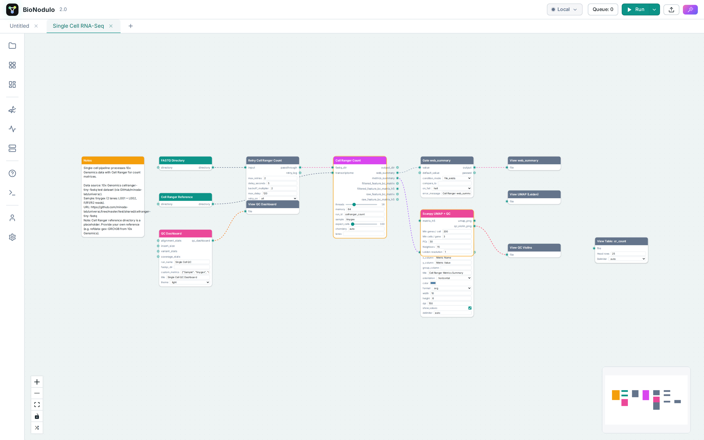
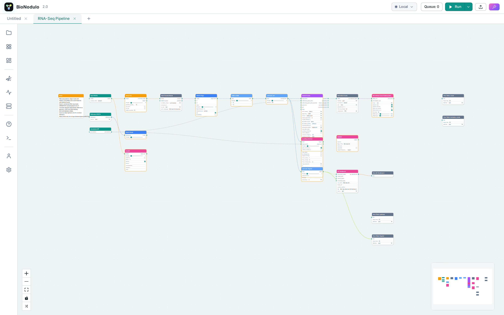
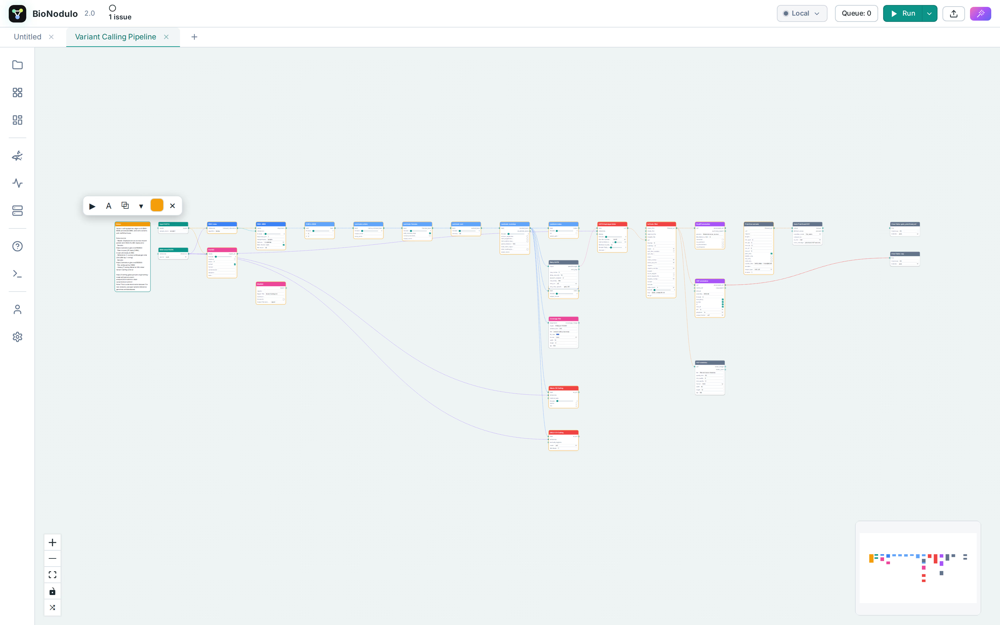
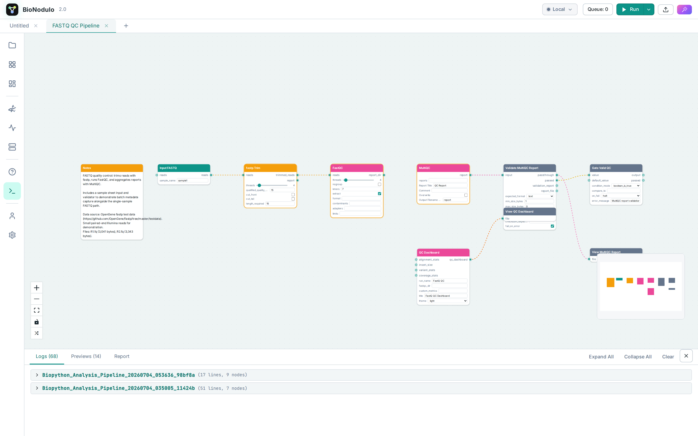
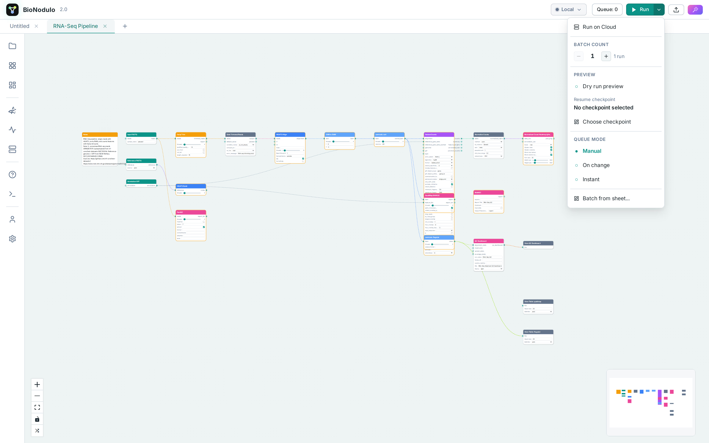
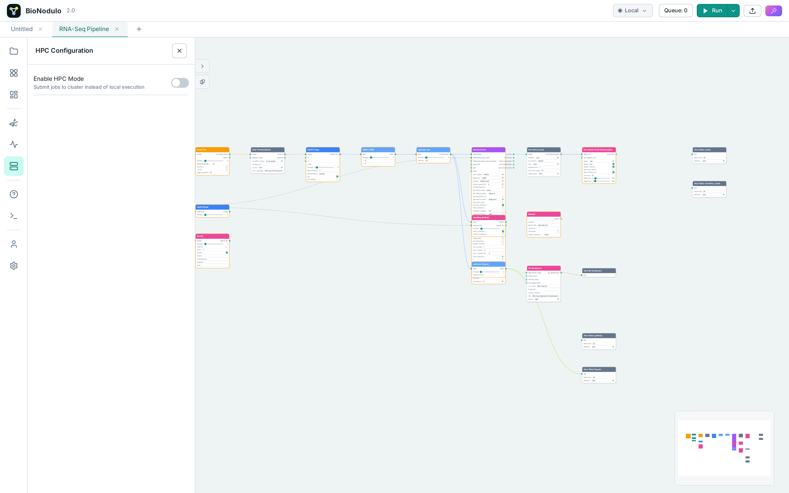

<p align="center">
  
</p>

<h1 align="center">BioNodulo</h1>

<p align="center">
  <strong>Visual bioinformatics pipelines, node by node.</strong>
</p>

<p align="center">
  <a href="pyproject.toml"></a>
  <a href="https://discord.gg/baNKVhZq6k"></a>
  <a href="LICENSE"></a>
  <a href="https://colab.research.google.com/github/Classacre/BioNodulo/blob/main/notebooks/BioNodulo_Colab.ipynb"></a>
  <a href="mcp/"></a>
  <a href="mcp/"></a>
  <a href="mcp/"></a>
</p>

BioNodulo is a professional-grade visual workflow workbench for bioinformatics. Build, execute, and share complex bioinformatics pipelines using an intuitive node-based graph editor.

<p align="center">
  <picture>
    <source media="(prefers-color-scheme: dark)" srcset=".github/assets/screenshots/dark/app.png" />
    <source media="(prefers-color-scheme: light)" srcset=".github/assets/screenshots/light/app.png" />
    
  </picture>
</p>

## Screenshots

<table>
  <tr>
    <td>
      <picture>
        <source media="(prefers-color-scheme: dark)" srcset=".github/assets/screenshots/dark/rnaseq-graph.png" />
        <source media="(prefers-color-scheme: light)" srcset=".github/assets/screenshots/light/rnaseq-graph.png" />
        
      </picture>
      <p align="center"><em>RNA-Seq pipeline in the node editor</em></p>
    </td>
    <td>
      <picture>
        <source media="(prefers-color-scheme: dark)" srcset=".github/assets/screenshots/dark/editor.png" />
        <source media="(prefers-color-scheme: light)" srcset=".github/assets/screenshots/light/editor.png" />
        
      </picture>
      <p align="center"><em>Node parameter editor</em></p>
    </td>
  </tr>
  <tr>
    <td>
      <picture>
        <source media="(prefers-color-scheme: dark)" srcset=".github/assets/screenshots/dark/console-run.png" />
        <source media="(prefers-color-scheme: light)" srcset=".github/assets/screenshots/light/console-run.png" />
        
      </picture>
      <p align="center"><em>Live run console</em></p>
    </td>
    <td>
      <picture>
        <source media="(prefers-color-scheme: dark)" srcset=".github/assets/screenshots/dark/run-on-cloud.png" />
        <source media="(prefers-color-scheme: light)" srcset=".github/assets/screenshots/light/run-on-cloud.png" />
        
      </picture>
      <p align="center"><em>One-click cloud execution</em></p>
    </td>
  </tr>
  <tr>
    <td colspan="2">
      <picture>
        <source media="(prefers-color-scheme: dark)" srcset=".github/assets/screenshots/dark/hpc-scheduler.png" />
        <source media="(prefers-color-scheme: light)" srcset=".github/assets/screenshots/light/hpc-scheduler.png" />
        
      </picture>
      <p align="center"><em>HPC scheduler integration (SLURM, PBS/Torque, SGE)</em></p>
    </td>
  </tr>
</table>

## Features

- **MCP Server** — Control BioNodulo from Claude, Codex/ChatGPT and other AI clients: account, credits, runs, workflows, files and local execution via a FastMCP server — see [`mcp/`](mcp/)
- **Visual Node Editor** — Drag-and-drop canvas for building workflows with 800+ built-in bioinformatics nodes
- **800+ Bioinformatics Nodes** — Covering QC, alignment, variant calling, assembly, RNA-Seq, metagenomics, phylogenetics, ChIP-Seq, single-cell analysis, BioPython integration, R scripting, and more
- **23 Pre-built Templates** — FASTQ QC Pipeline, RNA-Seq Pipeline, Variant Calling Pipeline, WGS Variant Pipeline, Genome Assembly, Metagenomics Profiling, Phylogenetics Pipeline, ChIP-Seq Pipeline, Single Cell RNA-Seq, DESeq2 Differential Expression, Transcript Quantification, Biopython Analysis Pipeline, R Visualization Pipeline, ONT Long-Read Sequencing, Proteomics Sage-Percolator Search, Protein Structure Database Workflow, WGBS Methylation Profiling, CRISPR Editing and Screen Analysis, Pangenomics Graph QC and Visualization, Metabolomics LC-MS Workflow, Spatial Transcriptomics QC and Clustering, Synthetic Biology Design and Simulation, ROBUST Designer
- **HPC Integration** — Submit workflows to SLURM, PBS/Torque, or SGE clusters with a single toggle
- **Workflow Converters** — Import and export workflows between SnakeMake, NextFlow, CWL, Galaxy, and BioNodulo JSON formats
- **Settings System** — Per-user settings with categories for appearance, canvas, execution, LLM, and files
- **Help / Wiki System** — Built-in searchable documentation panel (Ctrl+6)
- **AI Assistant** — Chat-based workflow builder assistant
- **Environment Manager** — Auto-detect missing dependencies, one-click install, Conda/Mamba/Micromamba env CRUD, Docker/Apptainer support, per-workflow isolation
- **Dependency Resolution** — Scans workflows on open for missing nodes, executables, and Python packages with a top-center banner + Auto Install
- **Custom Nodes** — Extensible plugin system for local custom node packages; Git URL installation exists in the backend but still needs frontend validation before it should be treated as a polished user flow
- **Dark/Light Theme** — Full theme support with system detection
- **Multi-tab Workflows** — Work on multiple workflows simultaneously with top tabs
- **Undo/Redo** — Full history support

## Quick Start

The easiest way to get started is with the **BioNodulo desktop app** or the **cloud platform** — no local setup required:

- **Desktop app** — download the latest build from [bionodulo.com](https://bionodulo.com) and follow the [desktop installation guide](https://docs.bionodulo.com/desktop/installation)
- **Cloud** — sign up at [bionodulo.com](https://bionodulo.com) and build & run workflows directly in your browser
- **Documentation** — full guides, node reference, and API docs at [docs.bionodulo.com](https://docs.bionodulo.com)

For an ephemeral notebook-based trial, launch the Colab notebook:

[](https://colab.research.google.com/github/Classacre/BioNodulo/blob/main/notebooks/BioNodulo_Colab.ipynb)

### Running from source

**Required on host PATH:**
- **Python 3.11+** — runs the FastAPI backend
- **micromamba** — creates isolated per-category conda environments for bioinformatics tools (auto-installed on first startup if missing)

**Required to build or develop the frontend:**
- **Node.js 20+ + npm** — builds the React/Vite frontend into `web/dist/`

**Required only for R-based workflows:**
- **Rscript** — needed by nodes such as DESeq2, ggplot2, pheatmap, edgeR, etc.

```bash
# Install Python dependencies
pip install -e .

# Build the frontend
cd web && npm install && npm run build && cd ..

# Start the application (then open http://localhost:8000)
python main.py

# Development mode with auto-reload (backend on 8765, Vite on 5173)
make dev
```

## MCP Server (Claude, Codex & other AI clients)

BioNodulo ships an [MCP](https://modelcontextprotocol.io) server ([`mcp/`](mcp/)) that lets AI agents manage your account, credits, cloud runs, workflows, files, and a locally running desktop app. See the [full MCP documentation](mcp/README.md) for the complete tool list and configuration options.

### 1. Install

Requires [uv](https://docs.astral.sh/uv/):

```bash
cd mcp
uv sync
```

### 2. Connect your AI client

The one-shot installer wires up **Codex CLI / IDE / ChatGPT desktop**, **Claude Code**, and **Claude Desktop** in one go:

```bash
uv run bionodulo-mcp install \
  --clerk-secret-key sk_live_... \
  --user-email you@example.com
```

Use `--client claude-code|claude-desktop|codex` to install just one client.

Or configure each client manually:

**Codex**

```bash
codex mcp add bionodulo \
  --env CLERK_SECRET_KEY=sk_live_... \
  --env BIONODULO_USER_EMAIL=you@example.com \
  -- uv --directory /path/to/BioNodulo/mcp run bionodulo-mcp
```

Verify with `codex mcp list`, then use `/mcp` inside a Codex session to confirm the BioNodulo tools are available.

**Claude Code**

```bash
claude mcp add bionodulo --scope user \
  --env CLERK_SECRET_KEY=sk_live_... \
  --env BIONODULO_USER_EMAIL=you@example.com \
  -- uv --directory /path/to/BioNodulo/mcp run bionodulo-mcp
```

Verify with `claude mcp list` — the server should show as connected.

**Claude Desktop** — add to `claude_desktop_config.json` (`%APPDATA%\Claude\` on Windows, `~/Library/Application Support/Claude/` on macOS), then restart the app:

```json
{
  "mcpServers": {
    "bionodulo": {
      "command": "uv",
      "args": ["--directory", "/path/to/BioNodulo/mcp", "run", "bionodulo-mcp"],
      "env": {
        "CLERK_SECRET_KEY": "sk_live_...",
        "BIONODULO_USER_EMAIL": "you@example.com"
      }
    }
  }
}
```

## Project Structure

```
bionodulo-v2/
├── main.py                    # Entry point
├── server.py                  # FastAPI app
├── pyproject.toml             # Package metadata
├── bionodulo.yaml.example     # Configuration template
├── Dockerfile                 # Container build
├── SPEC.md                    # Technical specification
├── bionodulo/                 # Backend package
│   ├── core/                  # Config, events, paths
│   ├── api/                   # REST API routes, WebSocket
│   ├── nodes/                 # Node system
│   │   ├── builtin/           # 800+ bioinformatics nodes
│   │   ├── base.py            # BaseNode class
│   │   ├── command_node.py    # External tool wrapper
│   │   ├── registry.py        # Node discovery & loading
│   │   └── schema_api.py      # Node schema definitions
│   ├── execution/             # Execution engine
│   ├── workflow/              # Workflow validation, serialization
│   ├── converter/             # SnakeMake, NextFlow, CWL, Galaxy
│   ├── hpc/                   # SLURM, PBS, SGE backends
│   ├── environments/          # Conda, Docker, Apptainer, env CRUD
│   │   ├── conda.py
│   │   ├── containers.py
│   │   ├── model.py
│   │   └── manager.py         # Environment lifecycle management
│   ├── manager/               # Custom nodes, diagnostics, dependency resolution
│   │   ├── resolver.py        # Workflow dependency resolution engine
│   │   ├── installer.py       # Async install jobs with progress tracking
│   │   ├── custom_nodes.py
│   │   └── diagnostics.py
│   ├── provenance/            # Workflow embedding, reports
│   └── ai/                    # AI assistant
├── mcp/                       # MCP server (Claude, Codex, other AI clients)
├── custom_nodes/              # Your custom nodes
├── templates/                 # 23 pre-built workflow templates
├── envs/                      # Generated per-workflow environments (ignored)
├── examples/workflows/        # Example workflows
├── cache/                     # Runtime cache
├── runs/                      # Execution outputs
└── web/                       # Frontend (React + Vite)
    ├── dist/                  # Generated frontend build output
    └── src/                   # Source code
```

## Optional Production Integrations

BioNodulo runs locally with no external services. For larger deployments you can opt into battle-tested infrastructure:

- **Redis** — set `BIONODULO_REDIS_URL` to replicate Yjs document updates and awareness across multiple backend instances.
- **OIDC / Keycloak / SuperTokens** — set `BIONODULO_OIDC_ISSUER`, `BIONODULO_OIDC_AUDIENCE`, and optionally `BIONODULO_OIDC_JWKS_URL` to accept externally issued JWTs.
- **LiteLLM Proxy** — choose the `litellm` AI provider and set `BIONODULO_LITELLM_BASE_URL` plus `LITELLM_API_KEY` to route models through a provider gateway.
- **SlowAPI** — REST rate limiting is enabled by default; set `BIONODULO_RATE_LIMIT_REDIS_URL` or `BIONODULO_REDIS_URL` to share rate-limit state between instances.

## License

BioNodulo is paid software distributed under the [BioNodulo Closed Alpha Commercial License](LICENSE).

Access during the current closed-alpha development phase is limited to authorized users and institutions with a written license, trial agreement, or closed-alpha invitation. BioNodulo may not be freely redistributed, mirrored, sublicensed, hosted for third parties, or used outside the licensed scope.

Third-party open-source and proprietary dependencies, command-line tools, datasets, containers, models, APIs, and services remain subject to their own license terms. See [Third-Party Notices](THIRD_PARTY_NOTICES.md) for the current compliance summary. Institutions can contact `nieuwenhuyzemikamartin@gmail.com` to discuss licensing and pricing.

BioNodulo is an independent bioinformatics workflow platform built specifically for bioinformatics pipeline design, execution, and sharing.
