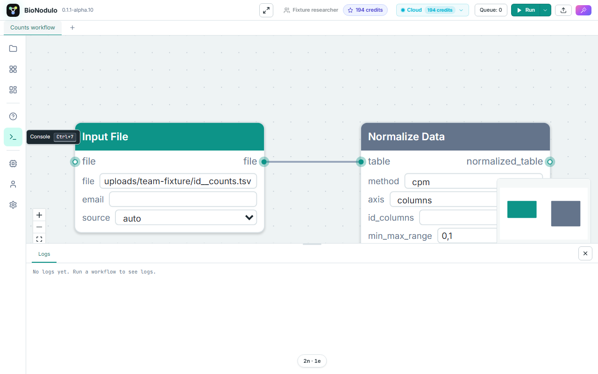

<p align="center">
  
</p>

<h1 align="center">BioNodulo</h1>

<p align="center">
  <strong>Build, run and share bioinformatics workflows — node by node.</strong><br />
  Desktop · Cloud · Your AI assistant
</p>

<p align="center">
  <a href="https://github.com/Classacre/BioNodulo/releases"></a>
  <a href="https://github.com/Classacre/BioNodulo/actions/workflows/ci.yml"></a>
  <a href="https://github.com/Classacre/BioNodulo/actions/workflows/secret-scan.yml"></a>
  <a href="LICENSE"></a>
  <a href="desktop/README.md"></a>
</p>

<p align="center">
  <a href="https://cloud.bionodulo.com/build/"></a>
  <a href="https://bionodulo.com/download"></a>
  <a href="https://docs.bionodulo.com"></a>
  <a href="https://docs.bionodulo.com/mcp/clients"></a>
</p>

BioNodulo is an open-source visual workflow editor for bioinformatics. Connect
tools on a canvas, explore their relationships, manage inputs and references,
and follow execution through node status, logs and outputs. Work in the desktop
app, the hosted cloud editor, or a supported AI client's embedded cloud app.

<p align="center">
  <br />
  <em>The shared cloud editor, shown with sample data in an MCP test host.</em>
</p>

## What you can do

| | Capability |
| --- | --- |
| **Build visually** | Connect typed inputs and outputs, organize workflow tabs, and start from bundled templates. |
| **Explore tools** | Search the node library and use [Tool Atlas](docs/tool-atlas.md) to inspect related tools, format matches and recorded evidence. |
| **Run where you work** | Use desktop/local and HPC integrations, or cloud compute with an account and team credit balance. |
| **Work with your AI** | Let an authorized assistant inspect the catalog, edit workflows, manage cloud files and monitor runs through MCP. |
| **Track results** | Follow node status and logs, then retrieve verified cloud outputs and reported run usage. |
| **Share and reproduce** | Collaborate on workflows, export supported formats, and collect tool references with the reference manager/exporter. |

The catalog distinguishes executable nodes from **reference-only bio.tools
entries**. Tool Atlas relationships are discovery aids, not proof of scientific
compatibility. See [tool integration profiles](docs/tool-integration.md) and
the [template catalog](docs/templates.md) for coverage and execution requirements.

## BioNodulo inside your AI client

Connect your client to the remote MCP endpoint:

```text
https://bionodulo.com/api/mcp
```

Sign in to BioNodulo, authorize the account/team permissions you need, then ask
your assistant: **“Open BioNodulo.”** In ChatGPT and Claude hosts that support
MCP Apps, this opens the **same full cloud app**: canvas, workflow tabs, toolbox,
templates, cloud Workspace, settings and run history. Its AI panel sends your
request to the host assistant; saved workflow changes appear in the editor.

<p align="center">
  <a href="https://docs.bionodulo.com/mcp/clients#chatgpt"></a>
  <a href="https://docs.bionodulo.com/mcp/clients#claude"></a>
  <a href="https://docs.bionodulo.com/mcp/clients#codex"></a>
  <a href="https://docs.bionodulo.com/mcp/clients#claude-code"></a>
</p>

Codex, Claude Code and other MCP clients can use the same cloud tools without
embedded UI. Cloud files belong to the authorized account/team; the remote
connector does not access your computer's filesystem. Read, write and run
permissions are separate. Paid cloud runs require explicit credit authorization;
the embedded app checks the current balance and compute estimate before each
submission, then shows progress, logs and verified outputs.

Use the [AI client setup guide](https://docs.bionodulo.com/mcp/clients) for
host-specific installation and permissions. The [portable plugin and repository
marketplaces](integrations/README.md) package the remote connection. A separate
[Claude Desktop extension](mcp/README.md#local-desktop-connection) connects to a
running local BioNodulo desktop app. Embedded UI availability depends on the
host; native ChatGPT/Claude rendering has not yet been verified for this release.

## Get started

| Choose your setup | Start here |
| --- | --- |
| **Cloud editor** | [Open BioNodulo](https://cloud.bionodulo.com/build/) and sign in to your account. |
| **Desktop app** | [Download for Windows, macOS or Linux](https://bionodulo.com/download). See [desktop setup](desktop/README.md). |
| **AI client** | [Connect ChatGPT, Claude, Codex or Claude Code](https://docs.bionodulo.com/mcp/clients). |
| **Notebook trial** | [Open in Colab](https://colab.research.google.com/github/Classacre/BioNodulo/blob/main/notebooks/BioNodulo_Colab.ipynb). |
| **From source** | Follow the commands below and the [development guide](docs/development.md). |

Workflow import/export support varies by format and node. Native Nextflow and
Snakemake conversion currently covers FastQC/MultiQC workflows; unsupported
graphs are rejected explicitly.

### Run from source

Use Python 3.11+ and Node.js 24 (see [`.nvmrc`](.nvmrc)). In an activated
Python virtual environment:

```sh
python -m pip install -e .
cd web
npm ci
npm run build
cd ..
python main.py
```

Open `http://localhost:8000`. Bioinformatics commands need their declared tool
environments; some workflows also need reference datasets or external services.
See [development setup](docs/development.md) for live reload, tests and checks,
and [Windows execution](docs/desktop/windows-local-execution.md) for WSL setup.

## Repository map

| Path | Contents |
| --- | --- |
| `bionodulo/` | Python API, node catalog, workflow engine and integrations |
| `web/` | React/TypeScript editor built with Vite |
| `desktop/` | Tauri desktop app and packaging |
| `mcp/` | MCP server and client installation instructions |
| `templates/` | Bundled workflows, thumbnails and small smoke-test inputs |
| `examples/`, `notebooks/` | Example workflows and Colab launcher |
| `tests/` | Backend tests and fixtures; frontend tests live in `web/` |
| `scripts/` | Catalog generation, validation and maintenance commands |
| `docs/` | Architecture, development and feature guides |
| `reports/` | Dated measurements and reproducible evidence |
| `data/` | Committed research/example datasets |
| `alembic/` | Database migration configuration |

`main.py` starts the application and `server.py` assembles the FastAPI services.
Local runs, workspaces, environments and build output are ignored by Git.
The hosted website, documentation site and cloud infrastructure are maintained
in the separate `bionodulo-website` repository.

## Developer guides

- [Documentation index](docs/README.md)
- [Tool Atlas](docs/tool-atlas.md) and [builtin expansion handbook](docs/builtin-expansion-playbook.md)
- [Architecture](docs/architecture.md)
- [Development and checks](docs/development.md)
- [Maintenance scripts](scripts/README.md)
- [Desktop app](desktop/README.md)
- [MCP connections](mcp/README.md), [native plugins](integrations/README.md) and [cloud app adapter](web/src/mcp/README.md)
- [Custom nodes](docs/help/custom-nodes.md)

## Community

<p align="center">
  <a href="https://discord.gg/baNKVhZq6k"></a>
  <a href="https://github.com/Classacre/BioNodulo/issues"></a>
  <a href="https://colab.research.google.com/github/Classacre/BioNodulo/blob/main/notebooks/BioNodulo_Colab.ipynb"></a>
</p>

## License

[GNU General Public License v3](LICENSE). Third-party tools, datasets,
containers, models and services retain their own license terms; see
[Third-Party Notices](THIRD_PARTY_NOTICES.md).
